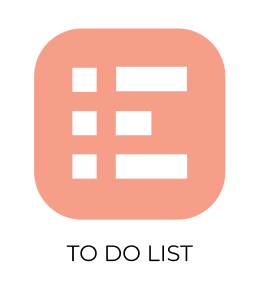

# what is the project ?

a simple Todo list app.

build it just for mobile

### Assets

- [figma commiunity todo app design](https://www.figma.com/community/file/1015172216261307231)
- [antDesign - ui library](https://ant.design/)

### tips

- store login and register in user cookie
- store user todo in localstorage or if you can it will be good to use IndexedDB : [check this](https://javascript.info/data-storage)
- use ant design please :)
- use less dependencies as you could

# code Review

make issue on this repo please :)
